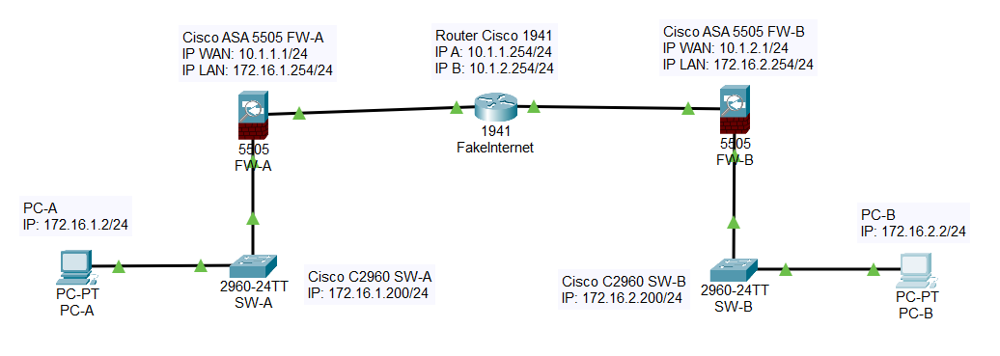

# VPN IPSec Site-to-Site in Cisco Packet Tracer

## Contesto

Quando si vogliono connettere tra loro due sedi remote, uno dei metodi più usati per garantire un collegamento sicuro utilizzando la rete Internet è quello di usare una VPN IPSec Site-to-Site, che in sostanza ci consente di far comunicare tra loro le sedi sfruttando un canale criptato.

Lo scopo di questo documento è descrivere come realizzare questo tipo di VPN con Cisco Packet Tracer, un software di Cisco che ci permette di simulare l'utilizzo di diversi componenti di rete Cisco (come switch, firewall, router, ecc...); l'utilizzo di Cisco Packet Tracer è utile sia per esercitarsi con la sintassi di questi dispositivi, sia per testare configurazioni da riportare poi nel mondo reale.

## Indirizzamenti e descrizione della rete

Per realizzare questo ambiente di test, si è scelta la più classica delle configurazioni: abbiamo innanzitutto due reti, rete A e rete B, con questo indirizzamento:

| Subnet        | Default router | Nome VLAN | ID VLAN |
|---------------|----------------|-----------|---------|
| 172.16.1.0/24 | 172.16.1.254   | ReteA     | 100     |
| 172.16.2.0/24 | 172.16.2.254   | ReteB     | 200     |

Per entrambe le reti, i due router predefiniti sono i due firewall Cisco ASA 5505 sui quali verrà configurata la VPN IPSec; per simulare la rete pubblica Internet, verrà utilizzato un router Cisco 1941 con due interfacce di rete, che si collegheranno all'interfaccia WAN dei due firewall, di seguito viene mostrato l'indirizzamento della parte "pubblica":

| Apparato        | Subnet      | Indirizzo IP   |
|-----------------|-------------|----------------|
| FW-A (ASA 5505) | 10.1.1.0/24 | 10.1.1.1/24    |
| FW-B (ASA 5505) | 10.1.2.0/24 | 10.1.1.2/24    |
| Router (int A)  | 10.1.1.0/24 | 10.1.1.254/24  |
| Router (int B)  | 10.1.2.0/24 | 10.1.2.254/234 |

A questa configurazione, vengono aggiunti uno switch e un PC per ogni rete, in modo da avere una simulazione più realistica:

| Apparato             | Subnet        | Indirizzo IP    |
|----------------------|---------------|-----------------|
| SW-A (Catalyst 2960) | 172.16.1.0/24 | 172.16.1.200/24 |
| SW-B (Catalyst 2960) | 172.16.2.0/24 | 172.16.2.200/24 |
| PC-A                 | 172.16.1.0/24 | 172.16.1.2/24   |
| PC-B                 | 172.16.2.0/24 | 172.16.2.2/24   |

Lo schema di rete risultante (e che viene creato direttamente in Cisco Packet Tracer) si presenta come segue:

## Configurazione della VPN sui firewall

Sui firewall viene quindi configurata la VPN IPSec usando come autenticazione una preshared key, il codice utilizzato per entrambi i dispositivi ASA 5505 viene indicato di seguito:

### FW-A

~~~
hostname FW-A
names
!
interface Ethernet0/0
 switchport access vlan 2
!
interface Ethernet0/1
!
interface Ethernet0/2
!
interface Ethernet0/3
!
interface Ethernet0/4
!
interface Ethernet0/5
!
interface Ethernet0/6
!
interface Ethernet0/7
!
interface Vlan1
 nameif inside
 security-level 100
 ip address 172.16.1.254 255.255.255.0
!
interface Vlan2
 nameif outside
 security-level 0
 ip address 10.1.1.1 255.255.255.0
!
object network ReteA
 subnet 172.16.1.0 255.255.255.0
object network ReteB
 subnet 172.16.2.0 255.255.255.0
!
route outside 0.0.0.0 0.0.0.0 10.1.1.254 1
!
access-list VPN-Acl extended permit ip object ReteA object ReteB
access-list VPN-Acl extended permit ip object ReteB object ReteA
!
!
access-group VPN-Acl out interface inside
!
!
!
!
!
telnet timeout 5
ssh timeout 5
!
dhcpd auto_config outside
!
!
dhcpd enable inside
!
!
crypto ipsec ikev1 transform-set VPN-Set esp-aes esp-sha-hmac
!
crypto map VPN-Map 10 match address VPN-Acl
crypto map VPN-Map 10 set peer 10.1.2.1 
crypto map VPN-Map 10 set security-association lifetime seconds 43200
crypto map VPN-Map 10 set ikev1 transform-set VPN-Set 
crypto map VPN-Map interface outside
crypto ikev1 enable outside
crypto ikev1 policy 10
 encr aes
 authentication pre-share
 hash sha
 group 5
 lifetime 43200
!
tunnel-group 10.1.2.1 type ipsec-l2l
tunnel-group 10.1.2.1 ipsec-attributes
 ikev1 pre-shared-key Nondirmela
~~~

### FW-B

~~~
hostname FW-B
names
!
interface Ethernet0/0
 switchport access vlan 2
!
interface Ethernet0/1
!
interface Ethernet0/2
!
interface Ethernet0/3
!
interface Ethernet0/4
!
interface Ethernet0/5
!
interface Ethernet0/6
!
interface Ethernet0/7
!
interface Vlan1
 nameif inside
 security-level 100
 ip address 172.16.2.254 255.255.255.0
!
interface Vlan2
 nameif outside
 security-level 0
 ip address 10.1.2.1 255.255.255.0
!
object network ReteA
 subnet 172.16.1.0 255.255.255.0
object network ReteB
 subnet 172.16.2.0 255.255.255.0
!
route outside 0.0.0.0 0.0.0.0 10.1.2.254 1
!
access-list VPN-Acl extended permit ip object ReteB object ReteA
access-list VPN-Acl extended permit ip object ReteA object ReteB
!
!
access-group VPN-Acl out interface inside
!
!
!
!
!
telnet timeout 5
ssh timeout 5
!
dhcpd auto_config outside
!
dhcpd enable inside
!
!
!
crypto ipsec ikev1 transform-set VPN-Set esp-aes esp-sha-hmac
!
crypto map VPN-Map 10 match address VPN-Acl
crypto map VPN-Map 10 set peer 10.1.1.1 
crypto map VPN-Map 10 set security-association lifetime seconds 43200
crypto map VPN-Map 10 set ikev1 transform-set VPN-Set 
crypto map VPN-Map interface outside
crypto ikev1 enable outside
crypto ikev1 policy 10
 encr aes
 authentication pre-share
 hash sha
 group 5
 lifetime 43200
!
tunnel-group 10.1.1.1 type ipsec-l2l
tunnel-group 10.1.1.1 ipsec-attributes
 ikev1 pre-shared-key Nondirmela
~~~

## Conclusioni e avvertenze

La creazione di una VPN "simulata" ci consente di provare diverse soluzioni e aggiungere complessità a questo scenario, ad esempio potremmo aggiungere più VLAN e più dispositivi per ogni subnet e vedere le problematiche di networking prima di andare in produzione, con risparmio di tempo e di mal di testa.

Il file di Cisco Packet Tracer è disponibile [a questo link](VpnIpsec.pkt).

N.B. A causa di quello che immagino sia un baco di Packet Tracer, all'interno della policy ikev1 non viene salvata l'istruzione "hash sha", pertanto dopo un riavvio dei dispositivi o comunque dopo la chiusura e successiva riapertura del file prodotto con Packet Tracer la VPN non funzionerà, sarà necessario inserire di nuovo l'istruzione su entrambi i firewall.