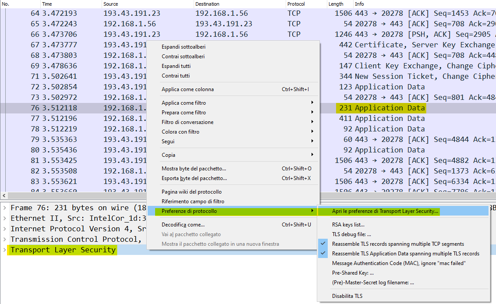
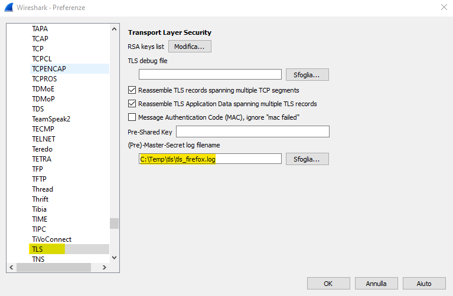
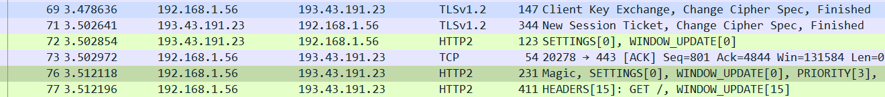

# Decrypting TLS traffic

## Capture Session Keys in Windows

Per poter decriptare il traffico HTTPS tra client e server, è possibile impostare una variabile d'ambiente sul client chiamata SSLKEYLOGFILE, e tramite un file batch è possibile assegnare un percorso al file su cui andranno salvate le session keys delle sessioni TLS che il client scambia con i server, in questo modo (qui si prende a riferimento Firefox, la stessa metodologia funzionerà con Chrome, ma non con i browser Microsoft):

~~~bat
@echo off
set SSLKEYLOGFILE=C:\Temp\tls\tls_firefox.log
start firefox
~~~

## Decrypting traffic

Una volta avviato il browser con il file batch indicato nella nota sopra, si può procedere alla cattura del traffico con Wireshark, dopodiché, navigare sui siti HTTPS di cui si vuole decriptare il traffico; una volta terminata la navigazione, interrompere la cattura in Wireshark, quindi importare le chiavi catturate tramite l'impostazione della variabile d'ambiente SSLKEYLOGFILE, scegliendo un pacchetto corrispondente alla conversazione TLS di cui decriptare i dati e cliccando con il tasto destro sulla voce "Transport Layer Security", quindi, sulla finestra che si aprirà, impostare il percorso indicato sopra in corrispondenza della casella denominata (Pre)-Master-Secret log filename, come mostrato nelle due immagini mostrate sotto:

Dopo questi passaggi, possiamo vedere come ora il traffico HTTP sia visibile in forma leggibile e non più in forma criptata

