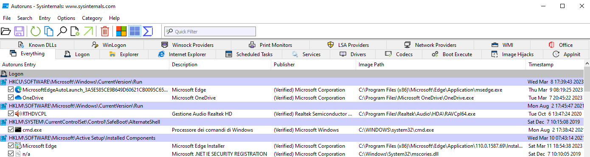
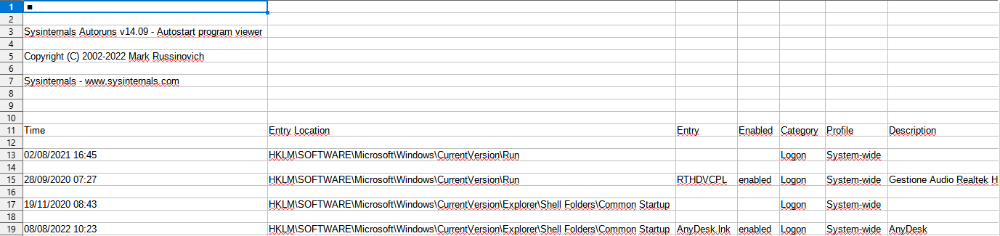

# Sysinternals Autoruns e Powershell

## Contesto

[Microsoft Sysinternals Autoruns](https://learn.microsoft.com/en-us/sysinternals/downloads/autoruns) è uno dei tanti utili strumenti della suite Sysinternals; in particolare, Autoruns serve per avere una panoramica completa di tutti i vari software, servizi, driver, GPO, operazioni pianificate che vengono fatti partire all'avvio di Windows.

Ciò ha implicazioni importanti anche in ambito cybersecurity, poiché il malware odierno ha la "simpatica" caratteristica di poter attivarsi anche dopo un riavvio del PC su cui si è insediato per poter continuare nella propria azione malevola, comportampento che prende il nome di persistenza; Autoruns può essere un alleato prezioso per scoprire se un malware cerca di partire ad ogni avvio del PC, ma siccome nei moderni sistemi Windows sono tantissimi gli elementi che partono all'avvio del sistema, un'analisi "manuale" del report di Autoruns può prendere molto tempo ed essere inefficace.

Per rendere più efficace l'interpretazione dei risultati di Autoruns, possiamo usare la versione a riga di comando di Autoruns (che prende il nome di autorunsc.exe) in abbinamento con Powershell, così da poter filtrare l'output nel modo che preferiamo; purtroppo questa operazione si è rivelata piuttosto ostica, a causa di alcuni difetti dell'esportazione dei risultati di Autoruns che spero il team di sviluppo del software risolva, ma alla fine, come vedremo, è comunque possibile ottenere ciò che vogliamo.

## Autoruns da riga di comando

Autoruns può funzionare sia tramite GUI sia da CLI. La GUI si presenta in questo modo:

e come possiamo vedere, è molto completa, forse anche troppo, quindi fare un'analisi accurata può prendere parecchio tempo.

In questo caso può essere d'aiuto utilizzare la versione a riga di comando, che, come detto poco sopra, prende il nome di autorunsc.exe; in questo caso, dobbiamo scegliere con una certa cura le opzioni da utilizzare, quelle che trovo interessanti sono le seguenti:

- -a: consente di analizzare una o più categorie di elementi che partono all'avvio, ad esempio, l (opzione di default) sta per logon, t per operazioni pianificate, s per servizi e driver, mentre per includerli tutti si userà *
- -accepteula: accetta in modo automatico la licenza per l'utilizzo del software
- -m: indica di non includere gli eseguibili Microsoft, poiché si ritengono affidabili
- -v e -vt: le due opzioni indicano di prendere l'hash degli elementi (dove possibile) e analizzarli con VirusTotal tramite API, così da avere un primo responso sulla pericolosità degli elementi; tenere conto che l'analisi di VirusTotal è possibile solo se quell'hash è già stato analizzato in passato, un elemento non analizzato in passato su VirusTotal è già per questo degno di interesse
- -c: permette di esportare i risultati di Autoruns in un file .csv delimitato da virgole
- -ct: permette di esportare i risultati di Autoruns in un file .csv delimitato da tabulazioni (vedremo come nel nostro caso ciò sia importante)
- -nobanner: consente di eliminare le intestazioni inutili lasciando solo le utili intestazioni di colonna

A questo punto, possiamo vedere un primo esempio di utilizzo di autorunsc, cercando per il momento di fare un'analisi semplice da un prompt powershell:

~~~powershell
.\autorunsc -a l -accepteula -m
~~~

da cui otterremo un output simile a questo:

~~~

Sysinternals Autoruns v14.09 - Autostart program viewer
Copyright (C) 2002-2022 Mark Russinovich
Sysinternals - www.sysinternals.com

HKLM\SOFTWARE\Microsoft\Windows\CurrentVersion\Run
   RTHDVCPL
     "C:\Program Files\Realtek\Audio\HDA\RAVCpl64.exe" -s
     Gestione Audio Realtek HD
     Realtek Semiconductor
     1.0.0.1132
     c:\program files\realtek\audio\hda\ravcpl64.exe
     28/09/2020 07:27

HKLM\SOFTWARE\Microsoft\Windows\CurrentVersion\Explorer\Shell Folders\Common Startup
   AnyDesk.lnk
     C:\ProgramData\Microsoft\Windows\Start Menu\Programs\Startup\AnyDesk.lnk
     AnyDesk
     AnyDesk Software GmbH
     7.0.14.0
     c:\program files (x86)\anydesk\anydesk.exe
     08/08/2022 10:23
~~~

cosa che, in situazioni molto più complesse di questa (che rappresentano la normalità), non ci è di nessuna utilità.

Potrebbe risultare più utile esportare i dati in formato .csv utilizzando questo comando:

~~~powershell
.\autorunsc -a l -accepteula -m -c > autoruns.csv
~~~

il file .csv risultante, se aperto, non è formattato bene e risulta non agevole da consultare, come possiamo vedere da questo screenshot:

Ci troviamo pertanto nella necessità di avere strumenti che consentano una maggiore automazione del processo di analisi, e in questo Powershell può venirci in aiuto.

## Autorunsc e Powershell

L'idea alla base è quella di esportare l'output di autorunsc in formato delimitato da virgole, importarlo con il cmdlet ConvertFrom-Csv in un oggetto per poi poter filtrare gli elementi di quell'oggetto nel modo che ci pare più opportuno.

Un primo tentativo potrebbe essere come il seguente:

~~~powershell
$objAutoruns = .\autorunsc -a l -accepteula -nobanner -m -c | ConvertFrom-Csv
~~~

il risultato dell'output dell'oggetto $objAutoruns però non è esaltante:

~~~

 ■Time                    :
Entry Location :
Entry                   :
Enabled               :
Category             :
Profile               :
Description       :
Company               :
Image Path         :
Version               :
Launch String   :

 ■Time                    : 02/08/2021 16:45
Entry Location : HKLM\SOFTWARE\Microsoft\Windows\CurrentVersion\Run
Entry                   :
Enabled               :
Category             : "Logon"
Profile               : System-wide
Description       :
Company               :
Image Path         :
Version               :
Launch String   :

 ■Time                    :
Entry Location :
Entry                   :
Enabled               :
Category             :
Profile               :
Description       :
Company               :
Image Path         :
Version               :
Launch String   :

 ■Time                    : 28/09/2020 07:27
Entry Location : "HKLM\SOFTWARE\Microsoft\Windows\CurrentVersion\Run"
Entry                   : "RTHDVCPL"
Enabled               : enabled
Category             : "Logon"
Profile               : System-wide
Description       : "Gestione Audio Realtek HD"
Company               : "Realtek Semiconductor"
Image Path         : "c:\program files\realtek\audio\hda\ravcpl64.exe"
Version               : 1.0.0.1132
Launch String   : """C:\Program Files\Realtek\Audio\HDA\RAVCpl64.exe"" -s"
~~~

in sostanza, si ripresenta il problema già visto nel file .csv esportato prima: ci sono righe vuote che vanno eliminate, inoltre le intestazioni non vengono identificate correttamente e contengono degli spazi, cosa consentita ma molto scomoda da gestire, e per finire, guardando le proprietà dell'oggetto con il cmdlet Get-Member

~~~powershell
$objAutoruns | Get-Member
~~~

ottengo un output molto poco rassicurante:

~~~

   TypeName: System.Management.Automation.PSCustomObject

Name                          MemberType   Definition
----                          ----------   ----------
Equals                        Method       bool Equals(System.Object obj)
GetHashCode                   Method       int GetHashCode()
GetType                       Method       type GetType()
ToString                      Method       string ToString()
Category             NoteProperty object Category=null
Company               NoteProperty object Company=null
Description       NoteProperty object Description=null
Enabled               NoteProperty object Enabled=null
Entry                   NoteProperty object Entry=null
Entry Location NoteProperty object Entry Location=null
Image Path         NoteProperty object Image Path=null
Launch String   NoteProperty object Launch String=null
Profile               NoteProperty object Profile=null
Version               NoteProperty object Version=null
 ■Time                    NoteProperty string  ■Time=
~~~

In sostanza, questo oggetto è inutilizzabile per i nostri scopi.

A questo punto, il primo passaggio consiste nell'eliminare le righe vuote dall'output di autorunsc, in questo modo:

~~~powershell
$objAutoruns = .\autorunsc -a l -accepteula -nobanner -m -c | Where-Object {$_.trim() -ne "" } | ConvertFrom-Csv
~~~

L'output migliora

~~~

 ■Time                    : 02/08/2021 16:45
Entry Location : HKLM\SOFTWARE\Microsoft\Windows\CurrentVersion\Run
Entry                   :
Enabled               :
Category             : "Logon"
Profile               : System-wide
Description       :
Company               :
Image Path         :
Version               :
Launch String   :

 ■Time                    : 28/09/2020 07:27
Entry Location : "HKLM\SOFTWARE\Microsoft\Windows\CurrentVersion\Run"
Entry                   : "RTHDVCPL"
Enabled               : enabled
Category             : "Logon"
Profile               : System-wide
Description       : "Gestione Audio Realtek HD"
Company               : "Realtek Semiconductor"
Image Path         : "c:\program files\realtek\audio\hda\ravcpl64.exe"
Version               : 1.0.0.1132
Launch String   : """C:\Program Files\Realtek\Audio\HDA\RAVCpl64.exe"" -s"
~~~

ma l'oggetto rimane sempre "buggato":

~~~
   TypeName: System.Management.Automation.PSCustomObject

Name                          MemberType   Definition
----                          ----------   ----------
Equals                        Method       bool Equals(System.Object obj)
GetHashCode                   Method       int GetHashCode()
GetType                       Method       type GetType()
ToString                      Method       string ToString()
Category             NoteProperty object Category=null
Company               NoteProperty object Company=null
Description       NoteProperty object Description=null
Enabled               NoteProperty object Enabled=null
Entry                   NoteProperty object Entry=null
Entry Location NoteProperty object Entry Location=null
Image Path         NoteProperty object Image Path=null
Launch String   NoteProperty object Launch String=null
Profile               NoteProperty object Profile=null
Version               NoteProperty object Version=null
 ■Time                    NoteProperty string  ■Time=
~~~

Per risolvere questo problema, una possibile soluzione consiste nel non includere le intestazioni originarie nell'output di autorunsc e indicare noi le intestazioni corrette, in questo modo:

~~~powershell
$headers = 'Time','EntryLocation','Entry','Enabled','Category','Profile','Description','Company','ImagePath','Version','LaunchString'
$objAutoruns = .\autorunsc -a l -accepteula -nobanner -m -c | Select-Object -Skip 1 | Where-Object {$_.trim() -ne "" } | ConvertFrom-Csv -Header $headers
~~~

In questo modo, l'output migliora decisamente:

~~~
Time          : 02/08/2021 16:45
EntryLocation : HKLM\SOFTWARE\Microsoft\Windows\CurrentVersion\Run
Entry         :
Enabled       :
Category      : "Logon"
Profile       : System-wide
Description   :
Company       :
ImagePath     :
Version       :
LaunchString  :

Time          : 28/09/2020 07:27
EntryLocation : "HKLM\SOFTWARE\Microsoft\Windows\CurrentVersion\Run"
Entry         : "RTHDVCPL"
Enabled       : enabled
Category      : "Logon"
Profile       : System-wide
Description   : "Gestione Audio Realtek HD"
Company       : "Realtek Semiconductor"
ImagePath     : "c:\program files\realtek\audio\hda\ravcpl64.exe"
Version       : 1.0.0.1132
LaunchString  : """C:\Program Files\Realtek\Audio\HDA\RAVCpl64.exe"" -s"
~~~

e anche le proprietà dell'oggetto ora corrispondono a qualcosa di utilizzabile:

~~~
   TypeName: System.Management.Automation.PSCustomObject

Name          MemberType   Definition
----          ----------   ----------
Equals        Method       bool Equals(System.Object obj)
GetHashCode   Method       int GetHashCode()
GetType       Method       type GetType()
ToString      Method       string ToString()
Category      NoteProperty string Category="Logon"
Company       NoteProperty string Company=
Description   NoteProperty string Description=
Enabled       NoteProperty string Enabled=
Entry         NoteProperty string Entry=
EntryLocation NoteProperty string EntryLocation=HKLM\SOFTWARE\Microsoft\Windows\CurrentVersion\Run
ImagePath     NoteProperty string ImagePath=
LaunchString  NoteProperty string LaunchString=
Profile       NoteProperty string Profile=System-wide
Time          NoteProperty string Time=02/08/2021 16:45
Version       NoteProperty string Version=
~~~

Infatti, se ora proviamo ad usare filtri sull'oggetto $objAutoruns

~~~powershell
$objAutoruns | Where-Object Enabled -eq 'Enabled' | Select-Object Time, Entry, Enabled, EntryLocation, ImagePath, LaunchString
~~~

otteniamo qualcosa di funzionale

~~~
Time          : 28/09/2020 07:27
Entry         : "RTHDVCPL"
Enabled       : enabled
EntryLocation : "HKLM\SOFTWARE\Microsoft\Windows\CurrentVersion\Run"
ImagePath     : "c:\program files\realtek\audio\hda\ravcpl64.exe"
LaunchString  : """C:\Program Files\Realtek\Audio\HDA\RAVCpl64.exe"" -s"

Time          : 08/08/2022 10:23
Entry         : "AnyDesk.lnk"
Enabled       : enabled
EntryLocation : "HKLM\SOFTWARE\Microsoft\Windows\CurrentVersion\Explorer\Shell
                Folders\Common Startup"
ImagePath     : "c:\program files (x86)\anydesk\anydesk.exe"
LaunchString  : "C:\ProgramData\Microsoft\Windows\Start Menu\Programs\Startup\AnyDesk.lnk"
~~~

Quindi tutto è bene quel che finisce bene? Non esattamente: ci possono essere casi in cui alcuni elementi contengono delle virgole, cosa che va a scompaginare completamente l'importazione di alcune righe dell'output; in questo caso viene in nostro soccorso la possibilità da parte di autorunsc di esportare l'output in un formato delimitato da tabulazioni, anche se in questo caso dovremo cambiare delimitatore nella fase di importazione nell'oggetto $objAutoruns, ma questo non rappresenta un problema

~~~powershell
$headers = 'Time','EntryLocation','Entry','Enabled','Category','Profile','Description','Company','ImagePath','Version','LaunchString'
$objAutoruns = .\autorunsc -a l -accepteula -nobanner -m -ct | Select-Object -Skip 1 | Where-Object {$_.trim() -ne "" } | ConvertFrom-Csv -Delimiter "`t" -Header $headers
~~~

Se vado quindi a filtrare l'oggetto $objAutoruns allo stesso modo di prima, otterrò lo stesso risultato, con il vantaggio che non devo temere che vi siano virgole inopportune:

~~~
Time          : 28/09/2020 07:27
Entry         : RTHDVCPL
Enabled       : enabled
EntryLocation : HKLM\SOFTWARE\Microsoft\Windows\CurrentVersion\Run
ImagePath     : c:\program files\realtek\audio\hda\ravcpl64.exe
LaunchString  : ""C:\Program Files\Realtek\Audio\HDA\RAVCpl64.exe"" -s

Time          : 08/08/2022 10:23
Entry         : AnyDesk.lnk
Enabled       : enabled
EntryLocation : HKLM\SOFTWARE\Microsoft\Windows\CurrentVersion\Explorer\Shell Folders\Common
                Startup
ImagePath     : c:\program files (x86)\anydesk\anydesk.exe
LaunchString  : C:\ProgramData\Microsoft\Windows\Start Menu\Programs\Startup\AnyDesk.lnk
~~~

## Un'analisi più completa

Negli esempi visti in precedenza, per semplicità, abbiamo chiesto ad autoruns di restituire solo un piccolo sottoinsieme di tutti gli elementi che partono in avvio, ma per capire se un malware ha ottenuto la persistenza sul nostro endpoint, necessitiamo di ottenere l'output più completo possibile con anche l'analisi degli hash tramite le API di VirusTotal; allo stesso momento, abbiamo anche la necessità di focalizzarci, almeno in una fase iniziale, solo su quegli elementi che riteniamo più degni di attenzione.

Il primo passaggio quindi consiste nell'ottenere tutti i dati possibili da autorunsc e fare un'analisi online con VirusTotal; ciò comporta anche avere un numero di colonne maggiori rispetto a prima, pertanto dovremo anche modificare il contenuto della variabile $headers:

~~~powershell
$headers = 'Time','EntryLocation','Entry','Enabled','Category','Profile','Description','Company','ImagePath','Version','LaunchString','VirusTotal','VTLink'
$objAutoruns = .\autorunsc -a * -accepteula -nobanner -m -v -vt -ct | Select-Object -Skip 1 | Where-Object {$_.trim() -ne "" } | ConvertFrom-Csv -Delimiter "`t" -Header $headers
~~~

In questo modo, otterremo diversi elementi, ed è piuttosto dispersivo guardarseli tutti, è meglio impostare qualche filtro che consenta di puntare l'attenzione su quegli elementi che presentano la maggior probabilità di essere parte di una compromissione, ad esempio prendendo quegli elementi abilitati e che non abbiano uno score uguale a zero nell'analisi di VirusTotal:

~~~powershell
$objAutoruns | Where-Object { $_.Enabled -eq 'Enabled' -and $_.VirusTotal -notlike '0*' } | Select-Object Time, Entry, Enabled, EntryLocation, ImagePath, LaunchString, VirusTotal, VTLink
~~~

In questo caso, viene restituito un output simile a questo (qui viene riportato solo un estratto):

~~~
Time          :
Entry         : wow64win
Enabled       : enabled
EntryLocation : HKLM\System\CurrentControlSet\Control\Session Manager\KnownDlls
ImagePath     : c:\windows\syswow64\wow64win.dll
LaunchString  : wow64win.dll
VirusTotal    : Unknown
VTLink        : n/a

Time          : 07/12/2019 10:09
Entry         : \Microsoft\Windows\NetTrace\GatherNetworkInfo
Enabled       : enabled
EntryLocation : Task Scheduler
ImagePath     : c:\windows\system32\gathernetworkinfo.vbs
LaunchString  : ""%windir%\system32\gatherNetworkInfo.vbs""
VirusTotal    : 1|73
VTLink        : https://www.virustotal.com/gui/file/d906d6126a1e9c9569ef81605d02f03ef94aa57b3
                ab9cbd56c996baf22fa461b/detection
~~~

Se invece abbiamo fondati sospetti di avere, ad esempio un malware che sfrutta le operazioni pianificate per ottenere la persistenza sulla macchina, possiamo scrivere una cosa simile:

~~~powershell
$objAutoruns | Where-Object { $_.Enabled -eq 'Enabled' -and $_.Category -eq 'Tasks' } | Select-Object Time, Entry, Enabled, EntryLocation, ImagePath, LaunchString, VirusTotal, VTLink
~~~

il cui output è come il seguente:

~~~
Time          : 07/12/2019 10:09
Entry         : \Microsoft\Windows\NetTrace\GatherNetworkInfo
Enabled       : enabled
EntryLocation : Task Scheduler
ImagePath     : c:\windows\system32\gathernetworkinfo.vbs
LaunchString  : ""%windir%\system32\gatherNetworkInfo.vbs""
VirusTotal    : 1|73
VTLink        : https://www.virustotal.com/gui/file/d906d6126a1e9c9569ef81605d02f03ef94aa57b3
                ab9cbd56c996baf22fa461b/detection

Time          : 27/02/2023 21:58
Entry         : \Mozilla\Firefox Background Update 308046B0AF4A39CB
Enabled       : enabled
EntryLocation : Task Scheduler
ImagePath     : c:\program files\mozilla firefox\firefox.exe
LaunchString  : ""C:\Program Files\Mozilla Firefox\firefox.exe"" --MOZ_LOG
                sync,prependheader,timestamp,append,maxsize:1,Dump:5 --MOZ_LOG_FILE C:\Progra
                mData\Mozilla-1de4eec8-1241-4177-a864-e594e8d1fb38\updates\308046B0AF4A39CB\b
                ackgroundupdate.moz_log --backgroundtask backgroundupdate
VirusTotal    : 0|73
VTLink        : https://www.virustotal.com/gui/file/9a43c57f3e98bd69789e8ccbeef2c1b6b5a3b1d06
                d63257bb4bd58dffa23689d/detection
~~~

Questi sono solo alcuni esempi, avendo un oggetto ben definito possiamo applicare tutti i tipi di filtri che desideriamo.