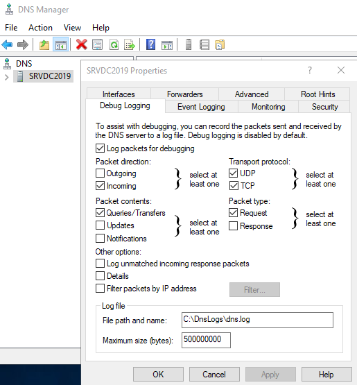

# Log DNS server e parsing del log con Powershell

## Contesto

In una rete con un dominio Windows, di solito i server DNS configurati sui domain controller fungono da server DNS per l'intera rete, pertanto è possibile avere un log delle richieste DNS fatte dai vari client così da individuare query DNS verso domini malevoli.

Una delle possibilità è quella di avere il log del server DNS in formato testuale, in questo caso però è necessario automatizzare il parsing del log per consentire di aggregare i dati per poterli analizzare, in questo Powershell, utilizzando le espressioni regolari, può essere un valido alleato.

## Configurazione logging DNS Server

Per modificare le impostazioni relative al logging di un server DNS in ambiente Windows, aprire la console del server DNS, cliccare con il tasto destro sul server e scegliere le proprietà del server, dalla finestra scegliere la scheda "Debug logging":

In questa videata si può vedere come il percorso del file di log corrisponda alla cartella C:\DnsLogs\dns.log; inoltre le impostazioni scelte consentono di avere un log "leggero" in cui di fatto vengono loggate solamente le query e non vengono salvate le informazioni di dettaglio, che rispetto ai prerequisiti sarebbe un appesantimento del log, senza contare il fatto che così si hanno anche vantaggi dal punto di vista prestazionale.

La configurazione del logging del server DNS porta ad avere un file che, tolte le intestazioni, si presenta così (vengono mostrate solo alcune righe)

~~~
01/02/2025 17:08:41 0CC0 PACKET  000001BA744A8950 UDP Rcv ::1             b96a   Q [0001   D   NOERROR] A      (13)validation-v2(3)sls(9)microsoft(3)com(0)

01/02/2025 17:09:42 0CC0 PACKET  000001BA74815DD0 UDP Rcv ::1             1c77   Q [0001   D   NOERROR] A      (1)c(3)pki(4)goog(0)

01/02/2025 17:10:12 0CC0 PACKET  000001BA792EA530 UDP Rcv 172.31.1.12     051f   Q [0001   D   NOERROR] A      (4)wpad(7)dominio(5)local(0)

01/02/2025 17:10:12 0CC0 PACKET  000001BA792F8180 UDP Rcv 172.31.1.12     11c9   Q [0001   D   NOERROR] SRV    (5)_ldap(4)_tcp(23)Default-First-Site-Name(6)_sites(2)dc(6)_msdcs(7)dominio(5)local(0)

01/02/2025 17:10:12 0CC0 PACKET  000001BA750EA5A0 UDP Rcv 172.31.1.12     990a   Q [0001   D   NOERROR] A      (9)srvdc2019(7)dominio(5)local(0)

01/02/2025 17:10:13 0CC0 PACKET  000001BA792EA530 UDP Rcv 172.31.1.12     5028   Q [0001   D   NOERROR] A      (12)bcnnablaiftm(7)dominio(5)local(0)

01/02/2025 17:10:13 0CC0 PACKET  000001BA792F8180 UDP Rcv 172.31.1.12     f38e   Q [0001   D   NOERROR] A      (3)dns(8)msftncsi(3)com(0)
~~~

Leggersi svariate righe così formattate ovviamente non porta nessun valore, pertanto si rende necessario consolidare i dati in qualcosa di più funzionale, così da ottenere dati quali i domini più richiesti, oppure i client con più richieste, ecc...

In questo può esserci d'aiuto Powershell, con uno script che tramite le espressioni regolari sia in grado di importare solamente i dati utili che verranno poi trasformati in un oggetto, nel quale poi sarà possibile fare tutte le interrogazioni del caso.

## Espressione regolare in Powershell per ottenere i dati necessari

Prima di procedere a scrivere codice, è meglio definire quali dati vogliamo ottenere: a noi servono le query DNS di tipo A fatte dai client da indirizzi IPv4, pertanto il primo passaggio consiste nel creare una espressione regolare che consente di ottenere solamete le righe che corrispondono a questi criteri; premesso che poi utilizzeremo un altro metodo, è buona norma fare qualche test preliminare, in questo caso utilizzeremo il cmdlet Select-String (analogo al comando grep in GNU/Linux) come segue:

~~~powershell
Select-String -Path .\dns.log -Pattern '^\d{2}\/\d{2}\/\d{4}\s\d{2}:\d{2}:\d{2}\s\w+\s\w+\s+\w+\s\w+\s\w+\s\d{1,3}\.\d{1,3}\.\d{1,3}\.\d{1,3}\s+\w+\s+Q\s\[\w+\s+\w+\s+\w+\]\sA\s+.*$'
~~~

Facendo riferimento alle righe di log viste nell'esempio precedente, otterremo questo output:

~~~
dns.log:34:01/02/2025 17:10:12 0CC0 PACKET  000001BA792EA530 UDP Rcv 172.31.1.12     051f   Q [0001   D   NOERROR] A      (4)wpad(7)dominio(5)local(0)
dns.log:38:01/02/2025 17:10:12 0CC0 PACKET  000001BA750EA5A0 UDP Rcv 172.31.1.12     990a   Q [0001   D   NOERROR] A      (9)srvdc2019(7)dominio(5)local(0)
dns.log:40:01/02/2025 17:10:13 0CC0 PACKET  000001BA792EA530 UDP Rcv 172.31.1.12     5028   Q [0001   D   NOERROR] A      (12)bcnnablaiftm(7)dominio(5)local(0)
dns.log:42:01/02/2025 17:10:13 0CC0 PACKET  000001BA792F8180 UDP Rcv 172.31.1.12     f38e   Q [0001   D   NOERROR] A      (3)dns(8)msftncsi(3)com(0)
~~~

dove però all'inizio di ogni riga abbiamo il nome del file e il numero di riga, dati che non ci servono, pertanto possiamo essere più precisi scrivendo

~~~powershell
Select-String -Path .\dns.log -Pattern '^\d{2}\/\d{2}\/\d{4}\s\d{2}:\d{2}:\d{2}\s\w+\s\w+\s+\w+\s\w+\s\w+\s\d{1,3}\.\d{1,3}\.\d{1,3}\.\d{1,3}\s+\w+\s+Q\s\[\w+\s+\w+\s+\w+\]\sA\s+.*$' | Select-Object -ExpandProperty Line
~~~

che ci permetterà di ottenere questo output, più rispondente alle nostre esigenze

~~~
01/02/2025 17:10:12 0CC0 PACKET  000001BA792EA530 UDP Rcv 172.31.1.12     051f   Q [0001   D   NOERROR] A      (4)wpad(7)dominio(5)local(0)
01/02/2025 17:10:12 0CC0 PACKET  000001BA750EA5A0 UDP Rcv 172.31.1.12     990a   Q [0001   D   NOERROR] A      (9)srvdc2019(7)dominio(5)local(0)
01/02/2025 17:10:13 0CC0 PACKET  000001BA792EA530 UDP Rcv 172.31.1.12     5028   Q [0001   D   NOERROR] A      (12)bcnnablaiftm(7)dominio(5)local(0)
01/02/2025 17:10:13 0CC0 PACKET  000001BA792F8180 UDP Rcv 172.31.1.12     f38e   Q [0001   D   NOERROR] A      (3)dns(8)msftncsi(3)com(0)
~~~

Già molto meglio, ma abbiamo ancora alcuni problemi: ci sono diversi dati che non ci servono, e soprattutto questo è un flusso di testo, non sono dati sui quali possiamo poi fare un qualsiasi tipo di interrogazione, pertanto dobbiamo sfruttare altre possibilità offerte da Powershell per raggiungere il nostro scopo.

## USARE GRUPPI, NAMED GROUPS E SOSTITUZIONI PER AGGREGARE I DATI

Dato che non vogliamo estrarre tutti i dati dal file di log ma solo data e ora, indirizzo IP del client e dominio cercato, dobbiamo identificare le parti di testo all'interno di ogni riga che corrispondono ai dati che ci servono, in questo ci vengono in aiuto i named groups; ad esempio, se vogliamo prendere solamente data e ora di una stringa identica a quella dei nostri log, possiamo scrivere codice simile a questo:

~~~powershell
$riga = '01/02/2025 17:10:12 0CC0 PACKET  000001BA792EA530 UDP Rcv 172.31.1.12     051f   Q [0001   D   NOERROR] A      (4)wpad(7)dominio(5)local(0)'
$riga -matches '^(?<DataOra>\d{2}\/\d{2}\/\d{4}\s\d{2}:\d{2}:\d{2})'
$Matches.DataOra
~~~

che come output restituirà quanto segue

~~~
01/02/2025 17:10:12
~~~

Il punto focale sta nella definizione del named group, che in un'espressione regolare si va a definire come segue:

~~~
(<?NomeNameGroup>pattern)
~~~

Questo concetto viene esteso nella lettura del file di log tramite il cmdlet Get-Content, il quale crea un array di stringhe che tramite un loop ForEach-Object verrà letto riga per riga, ed ogni riga verrà messa a confronto con il pattern dell'espressione regolare e, se c'è corrispondenza, verranno creati tre named groups corrispondenti a data e ora, IP del client e query del client:

~~~powershell
$TxtLog = Get-Content -Path 'C:\DnsLogs\dns.log'
$TxtLog | ForEach-Object {
    if ($_ -match '^(?<DataOra>\d{2}\/\d{2}\/\d{4}\s\d{2}:\d{2}:\d{2})\s\w+\s\w+\s+\w+\s\w+\s\w+\s(?<IpSrc>\d{1,3}\.\d{1,3}\.\d{1,3}\.\d{1,3})\s+\w+\s+Q\s\[\w+\s+\w+\s+\w+\]\sA\s+(?<Query>.*)$')
    {
        $DataOra = $Matches.DataOra
        $IpSrc = $Matches.IpSrc
        $QueryData = $Matches.Query
        Write-Output "$DataOra - $IpSrc - $QueryData"
    }
}
~~~

Da questo codice otterremo un output come questo:

~~~
01/02/2025 17:13:38 - 172.16.1.12 - (3)v10(6)events(4)data(9)microsoft(3)com(0)
01/02/2025 17:14:02 - 172.16.1.24 - (6)debian(3)org(0)
01/02/2025 17:14:52 - 172.16.1.12 - (12)settings-win(4)data(9)microsoft(3)com(0)
~~~

output che assomiglia molto a ciò che ci interessa e che volendo possiamo memorizzare in un oggetto per poi fare tutte le elaborazioni del caso, ma c'è solo una cosa che non va: il risultato della query è qualcosa di poco leggibile e sostanzialmente inutile, poiché noi vogliamo solo il dominio relativo alla query, dove per dominio si intende quello di secondo livello.

Per arrivare al risultato desiderato dobbiamo quindi "pulire" il dato relativo al dominio, e per farlo ancora una volta ci vengono in aiuto le espressioni regolari: per prima cosa dobbiamo ottenere tutte le occorenze che corrispondono a ( seguita da una o più numeri, una ) e una o più lettere; in questo caso torniamo ad utilizzare il cmdlet Select-String

~~~powershell
$riga = '(3)www(12)lorenzorossi(3)net(0)'
$occorrenze = $riga | Select-String -Pattern '\(\d+\)\w+' -AllMatches
$occorrenze.Matches | Select-Object Groups, Value
~~~

L'ultima riga di codice non è necessaria, ci serve solo per mostrarci le corrispondenze trovate con il cmdlet Select-String, la cui esecuzione genera questo output:

~~~
Groups Value
------ -----
{0}    (3)www
{0}    (12)lorenzorossi
{0}    (3)net
~~~

Da questo output possiamo vedere che a noi interessano solamente gli ultimi due valori, che sono richiamabili con il proprio numero di indice che comincia da zero, pertanto possiamo ottenerli come segue e concatenare i due valori per ottenere il nome di dominio:

~~~powershell
$TotaleOccorrenze = $occorrenze.Matches.Groups.Count
$SlDomain = $occorrenze.Matches.Groups[$TotaleOccorrenze - 2].Value
$TlDomain = $occorrenze.Matches.Groups[$TotaleOccorrenze - 1].Value
$domain = $SlDomain + '.' + $TlDomain
~~~

Con queste righe di codice abbiamo la variabile $domain che ha questo valore

~~~
(12)lorenzorossi.(3)net
~~~

siamo vicini ma ancora non corrisponde esattamente con i nostri desiderata, pertanto dobbiamo servirci anche questa volta delle espressioni regolari per sostituire i valori non necessari:

~~~powershell
$domain = $domain -replace '\(\d+\)',''
~~~

e finalmente otteniamo il nostro dominio come volevamo

~~~
lorenzorossi.net
~~~

Ora possiamo mettere assieme tutti i pezzi, dando una forma un filo più elegante al nostro codice:

~~~powershell
$DnsLog = 'C:\DnsLogs\dns.log'
$RegexDnsQueriesPattern = '^(?<DataOra>\d{2}\/\d{2}\/\d{4}\s\d{2}:\d{2}:\d{2})\s\w+\s\w+\s+\w+\s\w+\s\w+\s(?<IpSrc>\d{1,3}\.\d{1,3}\.\d{1,3}\.\d{1,3})\s+\w+\s+Q\s\[\w+\s+\w+\s+\w+\]\sA\s+(?<Query>.*)$'
$RegexHostname = '\(\d+\)\w+'
$RegexDomainName = '\(\d+\)'

$TxtLog = Get-Content -Path $DnsLog
$objLogs = $TxtLog | ForEach-Object {
    if ($_ -match $RegexDnsQueriesPattern) {
        $DataOra = $Matches.DataOra
        $IpSrc = $Matches.IpSrc
        $QueryData = $Matches.Query
        $Hostname = $QueryData | Select-String -Pattern $RegexHostname -AllMatches
        $NumHostnameMatches = $Hostname.Matches.Count
        $SlDomain = $Hostname.Matches[$NumHostnameMatches - 2].Value
        $TlDomain = $Hostname.Matches[$NumHostnameMatches - 1].Value
        $Domain = $SlDomain + '.' + $TlDomain
        $Domain = $Domain -replace $RegexDomainName,''
		
		[PSCustomObject]@{
            DataOra = $DataOra -as [datetime]
            IpSource = $IpSrc -as [ipaddress]
            Domain = $Domain
		}
    }
}

$objLogs
~~~

Queste istruzioni restituiscono questo output (naturalmente troncato):

~~~
01/02/2025 17:13:38 172.16.1.12 microsoft.com
01/02/2025 17:14:02 172.16.1.24 debian.org
01/02/2025 17:14:52 172.16.1.12 microsoft.com
~~~

La cosa più importante del codice riportato sopra è che come risultato finale non abbiamo più delle semplici stringhe, bensì un oggetto, cioé dati finalmente aggregati su cui possiamo fare tutte le analisi che riteniamo opportune.

## Link di approfondimento

- [Windows PowerShell and Regular Expressions](https://www.pluralsight.com/courses/powershell-regular-expressions)
- [Powershell: The many ways to use regex](https://powershellexplained.com/2017-07-31-Powershell-regex-regular-expression/#matches)