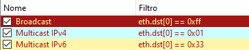

# Filtri per analisi multicast / broadcast

## Broadcast - multicast

In caso di rallentamenti sul traffico di rete, una delle possibili cause può essere una qualche forma di broadcast o multicast storm, dovute in genere a loop o a malfunzionamento (o configurazione errata) di un host.

Il traffico di broadcast o multicast è composto da pacchetti che non hanno come destinazione un singolo host, ma tutti gli host che fanno parte di un determinato segmento di rete, pertanto un numero eccessivo di questi pacchetti arriva a saturare la rete e a degradare le sue prestazioni.

Per una rapida identificazione di questi pacchetti, è possibile configurare su Wireshark un profilo ad hoc, su cui impostare alcuni filtri e regole di colorazione che possono aiutare nell'analisi di questo tipo di traffico di rete.

## Filtri di visualizzazione per analisi broadcast o multicast

- Broadcast
~~~
eth.dst[0] == 0xff
~~~

- Multicast IPv4
~~~
eth.dst[0] == 0x01
~~~

- Multicast IPv6
~~~
eth.dst[0] == 0x33
~~~

## Pulsanti su toolbar

Sulla toolbar di Wireshark è possibile aggiungere dei pulsanti con cui richiamare i filtri di visualizzazione indicati sopra:

| Etichetta         | Filtro visualizzazione |
|-------------------|------------------------|
| Broadcast         | eth.dst[0] == 0xff     |
| Multicast // IPv4 | eth.dst[0] == 0x01     |
| Multicast // IPv6 | eth.dst[0] == 0x33     |

## Regole di colorazione

Relativamente al profilo in esame, è possibile creare delle regole di colorazione corrispondenti ai filtri visti nel paragrafo precedente, come mostrato in figura:

