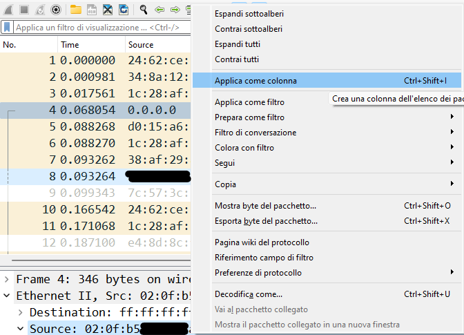
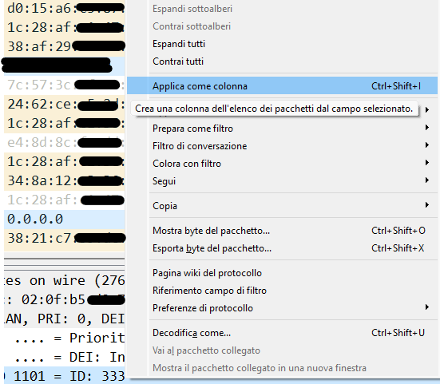

# Analisi del traffico di rete Layer 2 con Wireshark

## Contesto

A volte ci si trova a dover lavorare in contesti particolari, come reti con diverse VLAN e con le problematiche relative alla propagazione delle stesse; in queste situazioni, si può avere a che fare con problematiche che necessitano di un'analisi di rete del livello 2 dello stack ISO/OSI, in questo caso gli elementi che ci interessano sono soprattutto MAC address e VLAN.

Catturare il traffico di rete e analizzarlo con Wireshark può aiutarci a risolvere le problematiche connesse a queste situazioni.

## Aggiungere campi MAC address e VLAN in Wireshark

Il primo passo consiste nella creazione di un nuovo profilo in Wireshark per avere la visualizzazione più adatta all'analisi del traffico a livello 2, dopodiché, come scelta personale, vado a nascondere la visualizzazione del pannello 3, per concentrarmi sull'elenco dei pacchetti e sul dissector del traffico; il passaggio successivo, consiste nell'aggiungere i MAC address sorgente e destinazione come colonna nel pannello dell'elenco dei pacchetti:

Fatto questo, faremo lo stesso passaggio per aggiungere la colonna dell'ID delle VLAN 802.1q:

Tenere presente che l'ID delle VLAN di solito non è visibile nel normale traffico di rete, ma lo si trova in quello che chiamo il "traffico di frontiera", cioé il traffico di rete che intercorre nei collegamenti tra apparati diversi dove di solito vengono propagate le VLAN, le quali sono configurate sugli switch come "tagged" o "trunk" (il termine trunk indicato per il tagging delle VLAN viene usato in ambiente Cisco, mentre in ambiente HP o Aruba ha un altro significato).

## Display filter per MAC address

Uno dei casi più classici consiste nel filtrare il traffico in cui la sorgente o la destinazione a livello 2 è un determinato MAC address, per farlo, useremo un semplice display filter:

~~~
eth.addr == 02:0f:b5:a1:b2:c3
~~~

In determinate situazioni, potremmo essere interessati a visualizzare tutto il traffico che proviene da un determinato vendor, in tal caso siamo interessati solamente ai primi tre byte (cioé i primi 24 bit) del MAC address, useremo quindi un filtro come il seguente:

~~~
eth.addr[0:3] == 02:0f:b5
~~~

Ci sono alcuni casi in cui dobbiamo essere più precisi, ad esempio, potremmo essere interessati ad analizzare i pacchetti di un determinato vendor solo come sorgente del traffico in esame:

~~~
eth.src[0:3] == 02:0f:b5
~~~

Vi possono essere inoltre scenari in cui vogliamo escludere l'analisi dei pacchetti di determinati vendor:

~~~
eth.addr[0:3] != 02:0f:b5 && eth.addr[0:3] != 00:50:56
~~~

## Display filter per VLAN

Una casistica che, come tecnici di rete, ci capita piuttosto spesso è l'irraggiungibilità di alcuni dispositivi; in una rete complessa, ciò può dipendere da tantissime cose, e una delle possibili problematiche può consistere in una VLAN non propagata correttamente tra apparati, caso in cui potrebbe essere utile analizzare il traffico di rete filtrandolo per VLAN. Un esempio può consistere nel filtrare il traffico mostrando solo i pacchetti con un determinato VLAN ID:

~~~
vlan.id == 1056
~~~

Un altro scenario consiste nel filtrare il traffico mostrando soli i pacchetti che appartengono a due o più VLAN:

~~~
vlan.id == 1056 || vlan.id == 1068
~~~

Infine, possiamo trovarci nella situazione in cui escludere la visualizzazione dei pacchetti che non appartengono a più VLAN:

~~~
vlan.id != 1056 && vlan.id != 1068
~~~
