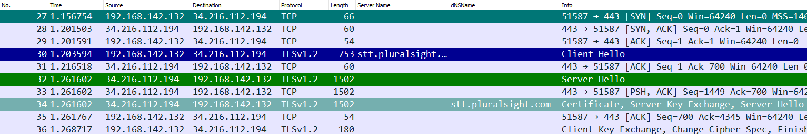

# Filtri per analisi traffico TLS

## Profilo di Wireshark

Prima di impostare i vari filtri di Wireshark, è bene creare un profilo dove memorizzarli, poiché se devo fare troubleshooting, ad esempio, su un problema relativo a DNS, o a comunicazioni di rete in genere, probabilmente non mi servirà avere a disposizione i filtri per conversazioni di tipo HTTPS / TLS.

In Wireshark posso creare diversi profili, che posso andare a richiamare a seconda del tipo di analisi che devo svolgere. Per creare un nuovo profilo chiamato TLS, dovrò andare sul menu Modifica -> Profili di configurazione, si aprirà una maschera come quella mostrata in figura:

Da questa finestra, per creare un nuovo profilo basta cliccare sul pulsante + e scrivere il nome del profilo, mentre per passare da un profilo all'altro bisogna cliccare sul profilo e poi cliccare su Ok.

Esiste anche un modo rapido per svolgere queste operazioni, cliccando sulla parte in basso a destra della finestra di Wireshark in corrispondenza della voce "Profilo: nomeProfilo":

## Filtri di visualizzazione per analisi TLS

- TLS Handshake Client hello:
~~~
tls.handshake.type == 1
~~~

- TLS Handshake Server hello:
~~~
tls.handshake.type == 2
~~~

- TLS Handshake Certificate:
~~~
tls.handshake.type == 11
~~~

Come strumenti di analisi non direttamente legati alla comunicazione TLS, definisco due semplici filtri TCP:

- TCP SYN
~~~
tcp.flags == 0x002
~~~

- TCP FIN
~~~
tcp.flags.fin == 1
~~~

## Pulsanti su toolbar

Sulla toolbar di Wireshark è possibile aggiungere dei pulsanti con cui richiamare i filtri di visualizzazione indicati sopra:

| Etichetta                     | Filtro visualizzazione   |
|-------------------------------|--------------------------|
| TCP // SYN                    | tcp.flags == 0x002       |
| TCP // FIN                    | tcp.flags.fin == 1       |
| TLS Handshake // Client Hello | tls.handshake.type == 1  |
| TLS Handshake // Server Hello | tls.handshake.type == 2  |
| TLS Handshake // Certificate  | tls.handshake.type == 11 |

Da notare il simbolo // che indica la creazione di un "menu" in cui sono inserite le voci indicate dopo la doppia barra, come mostrato in figura

## Regole di colorazione

In Wireshark, è possibile colorare le righe corrispondenti a una determinata tipologia di pacchetto tramite le regole di colorazione, che sono definite andando sul menu Visualizza -> Regole di colorazione, in cui è possibile impostare un colore di sfondo e un colore del testo per tutte le tipologie di pacchetto identificate tramite i soliti filtri di visualizzazione, come mostrato in figura

Ciò permetterà di identificare a colpo d'occhio i pacchetti che sono più interessanti per noi all'interno di una conversazione, come mostrato sotto:

